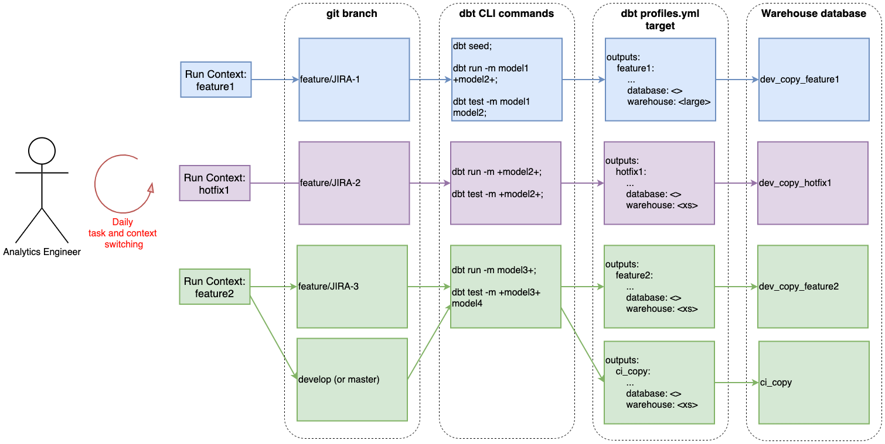

# dbt run configs

<p align="center">
  
</p>

This util helps manage [dbt](https://www.getdbt.com/) run configs so you don't need to keep searching through your command line history for the models to run for building and testing your dbt projects.

This is useful for when you are switching contexts between different work tasks.

## Use case background

During the day, you will often have to switch contexts between tasks e.g. features, hotfixes, environment refreshes, and code reviews.

Each context requires you to run different models, tests, from different branches, against different databases, with and without dbt seed/snapshot.

These utils help codify these contexts for easy switching to prevent human errors and increase development efficiency.



# Installation

## Overview

This method uses a Python script and accompanying config file. The task context is codified in the config file. You pass the name of the context into the Python script via the command line depending on which context you want to run.  

You can use your favorite IDE features to make this easier. See [IDE section](#ide-specific-setups).

## First time setup

💡 The main run script `main.py` expects the working directory to be the dbt repo root. i.e. it should be run from the repo root.

1. Install Python and Poetry


1. Clone this repo into your dbt project directory

1. The first time you run the script, it will copy the config template for you to `dbt_run_config_user.yml`.

1. Put your dbt run configs in `dbt_run_config_user.yml`. Instructions are inside the file. This file does not need to be checked into git and is gitignored by default.

## How the script works

`main.py` expects a command line argument called `--config` which is the name of a config in `dbt_run_config_user.yml`

The config file provides the details of what dbt needs to run. The run script will be sensible if `seed` or `models` or `test_models` is set or unset.

💡 You should set one target (in the `~\.dbt\profiles.yml`) for each config/context. This ensures you are using the right database and warehouse (compute) size for each task.

```shell
# Example to run a config called urbis from the command line
python main.py --config urbis
```

# IDE specific setups

Do what works for you. But if you need tips...

## PyCharm IDE

The idea is, you setup one PyCharm Run Configuration for one config in `dbt_run_config_user.yml`.

You then pass in the name of the config in the yml as an argument into the Python script `main.py`

### 1. Go to your run settings:


### 2. Ensure settings match what the script `main.py` expects

Setup one run profile per config. The `--config` flag is what's passed into the Python script.

Ensure the working directory is set to the root of the dbt repo.


#### Additional configs

Duplicate, and add the next config.


### 4. Run what you desire


Keyboard shortcut `Shift + F10` (IntelliJ IDEA Classic keymap).
